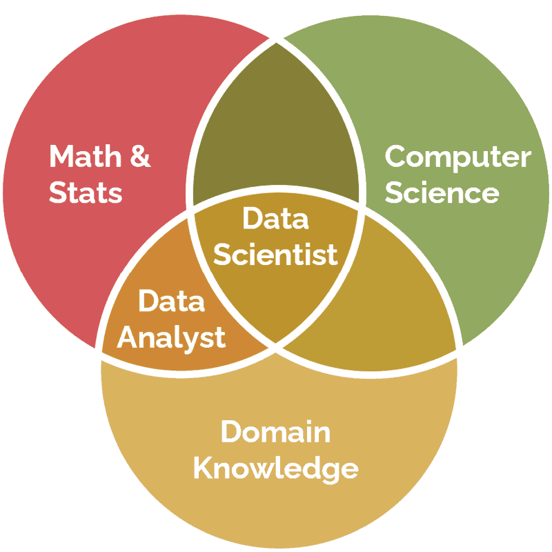

# Data Science
## What is Data Science?
Data Science is a *multidisciplinary field* that combines techniques from statistics, mathematics, computer science, and domain knowledge to extract insights and knowledge from data.

### Data Types
- Structured Data
- Semi-structured Data
- Unstructured Data
  
| Data Type       | Description                                          |
|-----------------|------------------------------------------------------|
| Structured      | It is data that has been organized into a stric schema (e.g., tables) |
| Semi-structured | It is data that doesn’t confirm to a schema but has some structure  (e.g., xml)|
| Unstructured    | It is data that has no schema   (e.g., photos)   |

```python
print("DS Bootcamp")
